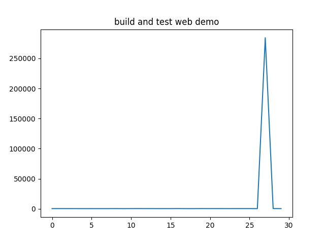

# Github Actions Runtime Graph
> output runtime graphs for github actions ci workflows

idea derived from [this](https://github.com/quick-lint/quick-lint-js/issues/165) issue.



## Requirements
- python >= 3.5
- matplotlib
## Usage
1. Ensure requirements are installed/ working.
2. Follow [this](https://docs.github.com/en/github/authenticating-to-github/creating-a-personal-access-token) to generate a personal access token.
3. Run the script with 
```bash
> python main.py --user="<Your github Username>" --token="<Your generated token>" --repo="<name of the workflow repo>" --owner="<owner of the workflow repo>"
```
4. Profit.

## Todo:
- make this tool async
